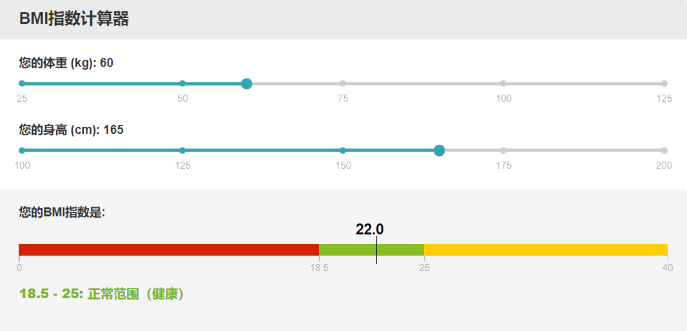

# BMI Calculator

BMI calculator as an embeddable web widget.



## Usage

Add the following iframe to your webpage ([sample use case](https://lowcarbfasthealth.com/)):

```html
<iframe src="https://leafsy.github.io/bmi-calculator/" frameborder="0" width="600" height="450" style="max-width: 100%"></iframe>
```

## Future Work
- Make display language configurable
- Add toggle for Imperial/Metric units

## License
[MIT](https://choosealicense.com/licenses/mit/)